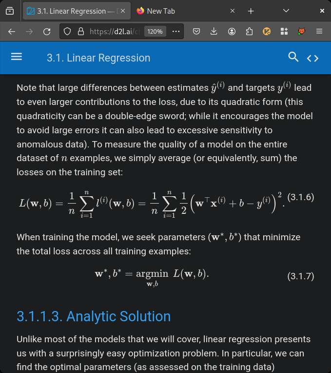

# Esto es un titulo


## Esto es un texto un poquito mas pequeño

1. esto
2. numera
3. las 
4. coasa


| hola | chao |
|------|------|
| 1    | 2    |
| 3    | 4    |


# Esto es una imagen



```python
print("esto es un programa en python que saluda a charlotte")
```
